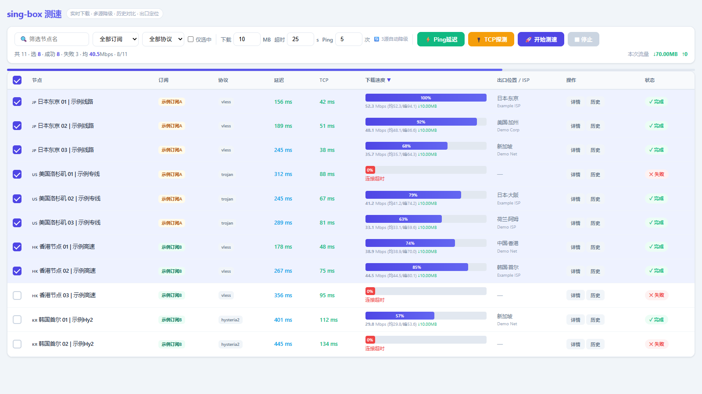

# singbox-speedtest

基于 [sing-box](https://github.com/SagerNet/sing-box) 的**多节点批量下载测速工具**。读取 sing-box 格式的配置文件，为每个代理节点启动独立的临时 sing-box 实例进行真实下载测速，完整支持 sing-box 的所有协议（vless / trojan / hysteria2 / shadowsocks / vmess / wireguard / tuic 等）。

适用于任何生成 sing-box 配置的工具——包括 [Karing](https://github.com/KaringX/karing)、clash-verge、自建配置等。

> 弥补 sing-box 生态中多节点批量下载测速的空白（如 Karing 官方已明确短期不内置该功能，见 [issue #1337](https://github.com/KaringX/karing/issues/1337)），实现 v2rayN 风格的后台批量测速体验。

---

## 目录

- [功能特性](#功能特性)
- [运行效果](#运行效果)
- [下载与安装](#下载与安装)
- [依赖说明](#依赖说明)
- [部署方式](#部署方式)
- [运行方式](#运行方式)
- [命令行参数](#命令行参数)
- [工作原理](#工作原理)
- [配置文件位置](#配置文件位置)
- [常见问题](#常见问题)
- [技术栈](#技术栈)

---

## 功能特性

### 核心能力

- **多节点批量下载测速**：后台串行下载测速，**不影响当前正在使用的节点**，工具内直接显示真实下载速度（MB/s）。这是 sing-box 生态中缺失而 v2rayN 具备的关键能力。
- **完整协议支持**：vless / trojan / hysteria2 / shadowsocks / vmess / wireguard / tuic 等，因为底层通过 sing-box 建立真实代理连接，所有协议均准确。
- **配置源通用**：只要配置文件是 sing-box 格式（含 `outbounds` 数组），无论来自 Karing、clash-verge 还是手写，都能直接读取测速。

### 延迟测试

- **Ping（sing-box 模式）**：经完整代理链路访问测试 URL，测**多次取最小值**（默认 5 次，可配 1-20），反映节点真实使用延迟。延迟值按区间颜色区分（绿 < 200ms / 蓝 < 500ms / 黄 < 1000ms / 红 ≥ 1000ms）。点击数值可查看每次样本柱状图。
- **TCP 探测**：直接 TCP 连接节点服务器端口，快速判断服务器是否存活。对 hysteria2 等 UDP 协议无意义，仅作辅助筛查。
- 两种延迟均支持多次测试，点击数值查看历史样本。

### 测速过程

- **分阶段实时状态**：每节点显示当前阶段 —— 解析中 → 启动代理 → 连接中 → 获取出口 IP → 下载中（实时进度百分比 + 瞬时速度），告别"卡住不知道在干嘛"。
- **均速 / 峰值 / 流量**：每个节点记录平均速度、峰值速度、消耗流量；顶部汇总本次测速总流量，清楚知道消耗了多少流量。
- **多测速源自动降级**：Cloudflare 被限流时自动切换 Cachefly 等备用源，确保测速总能完成。
- **失败原因反馈**：测速失败时显示具体原因（节点不可用 / 下载被截断 / 连接超时等），失败记录同样入库。

### 数据展示

- **真实出口 IP + 地理位置**：自动获取每个节点的出口 IP、国家/区域/城市、ISP 信息（通过 ip-api.com）。
- **测速历史**：持久化记录每次测速结果（含失败记录），支持节点速度趋势对比（较上次 ±Mbps）、成功率统计，判断长期稳定性。
- **订阅分组**：若配置源提供订阅分组信息（如 Karing 的 `karing_subscribe.json`），自动识别节点所属订阅源，支持按订阅/协议/名称筛选。
- **现代 Web 界面**：响应式表格、点击表头排序（测速时不自动重排）、详情面板（阶段日志）、历史记录柱状图。

---

## 运行效果

### Web 界面



启动后浏览器打开，界面分为顶部工具栏和节点表格两部分：

**顶部工具栏**：筛选节点名 / 订阅下拉 / 协议下拉 / 仅选中 / 下载大小(MB) / 超时(s) / Ping 次数 / 操作按钮 / 统计信息 / 本次流量。

**节点表格各列说明**：

| 列 | 说明 |
|---|---|
| ☐ | 勾选框（点击整行区域均可勾选）|
| 节点 | 节点名称，点击查看详情 |
| 订阅 | 所属订阅源（彩色徽章，若配置源提供）|
| 协议 | vless / trojan / hysteria2 等 |
| 延迟 | Ping 延迟（多次最小值，颜色区分，可点击看样本）|
| TCP | TCP 探测延迟（颜色区分）|
| 下载速度 | 进度条 + 均速/峰值/流量 |
| 出口IP / 位置 | IP 地址 + 国家城市·ISP |
| 操作 | 详情 / 历史 按钮 |
| 状态 | 待测 / 测速中（含阶段）/ ✓完成 / ✕失败 |

**详情面板**：点击节点名或「详情」按钮，弹窗显示服务器地址、订阅、协议、延迟、TCP、下载速度（均速/峰值）、出口 IP、地理位置/ISP、流量消耗、状态，以及带时间戳的完整阶段日志。

**历史面板**：点击「历史」按钮，弹窗显示该节点历史次数（成功/失败统计）、速度范围、较上次变化，以及历史记录表格（时间/结果/速度/延迟/出口IP/位置）。

### 命令行输出示例

```
配置: .../service_core.json
sing-box: .../sing-box.exe
已加载 119 个节点，订阅分组: ['示例订阅A', '示例订阅B']

先对 3 个节点做 ping 测试…

节点                                       订阅            延迟
--------------------------------------------------------------
🇯🇵 日本东京 01 | 示例线路                     示例订阅A      156ms
🇺🇸 美国洛杉矶 02 | 示例专线                  示例订阅A      245ms
🇭🇰 香港节点 01 | 示例高速                     示例订阅B      178ms

开始下载测速…

================================================================================
下载速度排名:
================================================================================
  1. 🇯🇵 日本东京 01 | 示例线路                52.3 Mbps  203.0.113.5    示例订阅A
  2. 🇭🇰 香港节点 01 | 示例高速                38.9 Mbps  203.0.113.50   示例订阅B
  3. 🇺🇸 美国洛杉矶 02 | 示例专线             41.2 Mbps  203.0.113.10   示例订阅A

本次总流量: ↓30MB ↑0MB
```

---

## 下载与安装

### 方式一：Git 克隆（推荐）

```bash
git clone https://github.com/<你的用户名>/singbox-speedtest.git
cd singbox-speedtest
```

### 方式二：下载 ZIP

从 GitHub 仓库页面点 `Code → Download ZIP`，解压即可。

### 无需安装步骤

本工具是**单文件 Python 脚本**，无需编译、无需 `pip install`。下载后直接运行：

```bash
python singbox_speedtest.py
```

---

## 依赖说明

### Python 依赖

**零第三方依赖**，仅需 Python 3.8+ 标准库。无需 `pip install` 任何包。

验证方式：所有 import 均为标准库（http.server / subprocess / json / threading / socket 等）。

### 外部工具（必需）

| 工具 | 用途 | 是否自带 | 获取方式 |
|------|------|---------|---------|
| **Python 3.8+** | 运行主程序 | 需安装 | [python.org](https://www.python.org/downloads/) |
| **sing-box** | 为每个节点启动临时代理实例 | 需获取 | 见下方 |
| **curl** | 下载测速文件 | Windows 10+/Linux/macOS 自带 | 系统自带 |

#### 获取 sing-box

**方式 A（推荐，零额外操作）**：如果你已安装 v2rayN / Karing 等含 sing-box 的客户端，直接复用其自带的 sing-box，工具会自动发现。

**方式 B**：从 [sing-box 官方 Release](https://github.com/SagerNet/sing-box/releases) 下载，解压后：
- 放入系统 PATH（推荐），或
- 用 `--singbox` 参数指定完整路径

工具查找 sing-box 的优先级：系统 PATH → v2rayN 常见安装路径 → `--singbox` 参数指定。

---

## 部署方式

本工具**可完全独立运行**，不必放入任何代理客户端的安装目录。

### 独立部署（推荐）

把项目放在任意独立目录即可：

```
任意目录/
└── singbox-speedtest/
    └── singbox_speedtest.py
```

工具只做两件事，均与代理客户端的运行状态无关：
1. **读取** sing-box 格式的配置文件来获取节点列表 —— 配置源客户端（如 Karing）无需运行，只要配置文件存在
2. **调用** sing-box 和 curl 测速 —— 独立子进程，与正在运行的代理客户端完全隔离

### 前置条件

1. 拥有一份 sing-box 格式的配置文件（含 `outbounds` 数组）—— 可来自 Karing、clash-verge、手写等
2. 系统中有 sing-box（v2rayN 自带 / Karing 内嵌但无独立 exe / 官网下载）
3. 已安装 Python 3.8+

### 各系统部署

**Windows**：
```bash
python singbox_speedtest.py
# 若 sing-box 不在 PATH 且未装 v2rayN，需指定路径：
python singbox_speedtest.py --singbox "C:\path\to\sing-box.exe"
```

**Linux / macOS**：
```bash
python3 singbox_speedtest.py
# sing-box 需自行下载加入 PATH
```

---

## 运行方式

### Web 界面模式（推荐）

```bash
python singbox_speedtest.py
```

浏览器打开 `http://127.0.0.1:8088`，操作流程：

1. （可选）用筛选框按订阅/协议/名称筛选节点
2. 勾选要测试的节点
3. 点 **⚡ Ping 延迟** 批量测延迟（并发，秒级完成）
4. 按延迟排序，勾选低延迟节点
5. 点 **🚀 开始测速** 做深度下载测速，看实时进度
6. 点节点名或 **详情** 查看阶段日志、出口 IP、地理位置
7. 点 **历史** 查看历史测速记录，对比稳定性

> 局域网其他设备也可通过 `http://你的IP:8088` 访问。

### 命令行模式

```bash
# 筛选含"日本"的节点测速
python singbox_speedtest.py --cli --filter 日本

# 自定义参数
python singbox_speedtest.py --cli --bytes 52428800 --timeout 30

# 指定配置文件（来自任意 sing-box 配置源）
python singbox_speedtest.py --core /path/to/service_core.json

# 指定 sing-box 路径
python singbox_speedtest.py --singbox "/path/to/sing-box.exe"
```

---

## 命令行参数

| 参数 | 默认值 | 说明 |
|------|--------|------|
| `--core` | 自动定位 | sing-box 配置文件（`service_core.json`）路径 |
| `--subscribe` | 自动定位 | 订阅分组文件路径（可选，用于订阅分组显示，如 Karing 的 `karing_subscribe.json`）|
| `--singbox` | 自动查找 | `sing-box` / `sing-box.exe` 路径 |
| `--bytes` | 10485760 | 测速下载字节数（默认 10MB）|
| `--timeout` | 25 | 单节点测速超时秒数 |
| `--port` | 8088 | Web 界面端口 |
| `--cli` | - | 启用命令行模式（不启动 Web）|
| `--filter` | - | 节点名筛选关键字（CLI 模式）|

Web 界面上的「下载 MB / 超时 s / Ping 次数」输入框可实时调整测速参数，无需重启。

---

## 工作原理

```
sing-box 配置                      本工具
┌───────────────────┐
│ service_core.json │──读取──→ 1. 提取所有代理节点（sing-box outbounds）
│  (sing-box格式)   │           2. 为每个节点生成临时 sing-box 配置
└───────────────────┘              ↓
                              3. 启动临时 sing-box 实例（本地端口）
┌───────────────────┐              ↓
│ subscribe.json    │──读取──→ 4. 经该实例 curl 下载测速文件
│ (订阅分组, 可选)  │           5. 计算速度/延迟/流量，获取出口IP
└───────────────────┘              ↓
                               6. Web 界面实时展示 + 历史记录
```

每个节点的测速过程完全独立，串行执行互不干扰，**不影响正在使用的代理节点**。这实现了 v2rayN 的多节点后台测速体验，同时完整支持 sing-box 的所有协议。

### 测速源

内置多个测速源，按优先级自动降级（某源被限流/失败时自动切换下一个）：

1. `https://speed.cloudflare.com/__down?bytes={bytes}`（Cloudflare，支持自定义大小）
2. `https://cachefly.cachefly.net/10mb.test`（Cachefly 10MB 固定文件）
3. `https://cachefly.cachefly.net/50mb.test`（Cachefly 50MB 固定文件）

> Cloudflare 对代理出口 IP 的大文件请求可能限流（返回截断响应），多源降级机制确保测速总能完成。

---

## 配置文件位置

工具默认从常见代理客户端的配置目录读取 sing-box 配置：

| 配置源 | 配置文件 | 默认查找路径（Windows）|
|--------|---------|----------------------|
| Karing | `service_core.json` | `%APPDATA%\karing\karing\` |
| 其他 | 任意 sing-box 配置 | 用 `--core` 参数指定 |

订阅分组文件（可选，用于订阅分组显示）：

| 配置源 | 订阅文件 | 说明 |
|--------|---------|------|
| Karing | `karing_subscribe.json` | 含订阅 remark 与节点对应关系 |

测速历史记录保存在配置文件同目录下的 `singbox_speedtest_history.json`（每节点最多 50 条）。

---

## 常见问题

**Q: 启动报错"找不到 sing-box"？**
A: sing-box 不在 PATH 且未装 v2rayN 等客户端。用 `--singbox` 参数指定 sing-box 完整路径，或将其加入系统 PATH。

**Q: 启动报错"找不到配置 service_core.json"？**
A: 用 `--core` 参数指定你的 sing-box 配置文件路径。该文件通常由代理客户端（如 Karing）运行后生成。

**Q: 测速时正在使用的代理会受影响吗？**
A: 不会。本工具为每个节点启动独立的临时 sing-box 实例（使用不同的本地端口），与正在运行的代理客户端完全隔离。

**Q: 支持 hysteria2 等 UDP 协议吗？**
A: 支持。所有协议的延迟和测速都通过 sing-box 完整链路测试，UDP 协议（如 hysteria2）同样准确。

**Q: Ping 延迟和 TCP 探测哪个准？**
A: Ping（sing-box 模式）远比 TCP 探测有参考价值——它测的是完整代理链路的真实延迟，等于你实际使用时的延迟。TCP 探测只用于快速判断服务器是否存活，对 hysteria2 等 UDP 协议无意义。

**Q: 测速很慢/某节点卡住？**
A: 每个节点测速受 `--timeout` 控制（默认 25s），超时自动跳过。慢节点或被限流的测速源会自动降级到备用源。看「详情」面板的阶段日志可知卡在哪一步。

**Q: 历史记录在哪？能清除吗？**
A: 在配置文件同目录的 `singbox_speedtest_history.json`。删除该文件即可清除全部历史。

**Q: 支持 clash/mihomo 的配置吗？**
A: 当前仅支持 sing-box 格式（`outbounds` 数组）。clash 格式需先用客户端转换或手动转成 sing-box 格式。

---

## 技术栈

- **Python 3.8+**（纯标准库，零依赖）
- **sing-box**（代理协议支持）
- **curl**（下载测速）
- 前端：原生 HTML/CSS/JavaScript（无构建工具，内嵌于 Python 单文件）

---

## 相关项目

本工具依赖以下开源项目（本仓库**不包含**它们的二进制文件，需自行获取）：

| 项目 | 说明 | 仓库 | 下载 |
|------|------|------|------|
| **sing-box** | 本工具的底层引擎，用于建立代理连接进行测速 | [SagerNet/sing-box](https://github.com/SagerNet/sing-box) | [Releases](https://github.com/SagerNet/sing-box/releases) |
| **curl** | 下载测速文件 | [curl/curl](https://github.com/curl/curl) | 系统自带 / [curl.se](https://curl.se/download.html) |

兼容的配置源（生成 sing-box 格式配置的客户端）：

| 客户端 | 仓库 |
|--------|------|
| Karing | [KaringX/karing](https://github.com/KaringX/karing) |

> 获取 sing-box 最便捷的方式：若已安装 v2rayN 等客户端，复用其自带的 sing-box 即可，无需额外下载。

---

## 许可

仅供学习交流使用。
